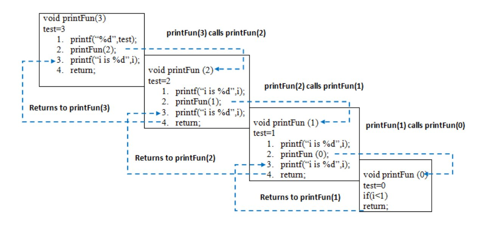

# Recursion

## What is Recursion ?

Process in which a function called itself directly or indirectly is called recursion.

### Properties of Recursion:

Performing the same operations multiple times with different inputs.
In every step, we try smaller inputs to make the problem smaller.
Base condition is needed to stop the recursion otherwise infinite loop will occur.

### Algorithm Steps:

1. Define a base case: IDentify the simplest case for which the solution is known or trivial. This is the stopping condition for the recursion, as it prevents from calling the function infinitely.

2. Define a recursive case: Define the problems in terms of smaller subproblems. Break the problem down into smaller versions of itself, and call the function recursively to solve each subproblem.

3. Ensure the recursion terminates: Make sure that the recursive function reaches the base case, and terminates the infinite loop.

4. Combine the solutions: Combine the solutions of the subproblem to solve the original problem.

### How are recursive functions stored in memory?

Recursion uses more memory, because recursive function adds to the stack with each recursive call. Follows LIFO (Last In First OUT).

int fact(int n)
{
    if (n < = 1) // base case
        return 1;
    else    
        return n*fact(n-1);    
}

In the above example, the base case for n < = 1 is defined and the larger value of a number can be solved by converting to a smaller one till the base case is reached.

### Differnce between direct and Indirect recursive calls?
1. If a function called is inside the same function then it is direct recursive function. ANd if it is called from some other function then it is called indirect recursive function.

### Difference beween tailed and non-tailed recursions?
A func is recursive, if the recursive call is the last thing executed by the function.

In the recursive function, when any function is called from the main, the memory is allocated to it on the top of stack, In any recursive function call the called function memory is allocated on the top of the calling function and a different copy of local variables is created for each function call. When the base case is reached, the func returns its value to the calling function and memory is de-allocated and the process continues.

function printFun(test)
    {
        if (test < 1)
            return;
        else {
            document.write(test + " ");
            printFun(test - 1); // statement 2
            document.write(test + " ");
            return;
        }
    }

// Driver code
    let test = 3;
    printFun(test);

// output -> 3 2 1 1 2 3 

### Recursion VS Iteration

| **Recursion**	| **Iteration** |
|-----------| -----------|
|  Terminates when the base case becomes true.	| Terminates when the condition becomes false. |
|  Used with functions.	| Used with loops. |
| Every recursive call needs extra space in the stack memory. |	Every iteration does not require any extra space. |
| Smaller code size. |	Larger code size. |

### Applications of Recursion

* **Tree and graph traversal**: Recursion is frequently used for traversing and searching data structures such as trees and graphs. Recursive algorithms can be used to explore all the nodes or vertices of a tree or graph in a systematic way.
* **Sorting algorithms:** Recursive algorithms are also used in sorting algorithms such as quicksort and merge sort. These algorithms use recursion to divide the data into smaller subarrays or sublists, sort them, and then merge them back together.
* **Divide-and-conquer algorithms:** Many algorithms that use a divide-and-conquer approach, such as the binary search algorithm, use recursion to break down the problem into smaller subproblems.
* **Fractal generation:** Fractal shapes and patterns can be generated using recursive algorithms. For example, the Mandelbrot set is generated by repeatedly applying a recursive formula to complex numbers.
* **Backtracking algorithms:** Backtracking algorithms are used to solve problems that involve making a sequence of decisions, where each decision depends on the previous ones. These algorithms can be implemented using recursion to explore all possible paths and backtrack when a solution is not found.
* **Memoization:** Memoization is a technique that involves storing the results of expensive function calls and returning the cached result when the same inputs occur again. Memoization can be implemented using recursive functions to compute and cache the results of subproblems.

### Disadvantages of Recursion

1. Recursive pgm has greater space requiremns than the iterative program, as all functions will remain in the stack until the bse case is reached.
2. Required more time because of function calls and return overhead.

### Advantages of recursion

It provides a clean and simple way to write code. Some problems are inherently recursive like Tree Traversals, Tower of Hanoi etc.
